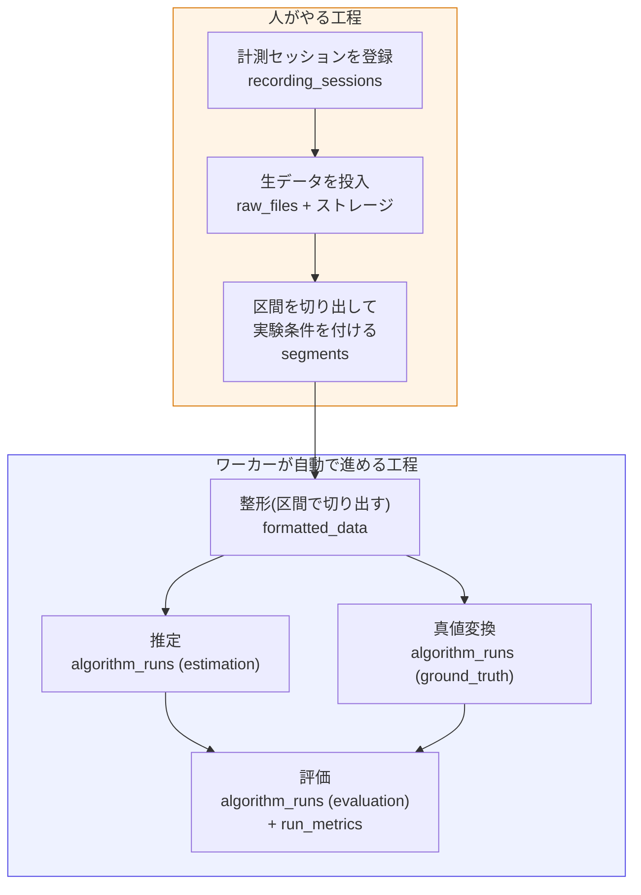
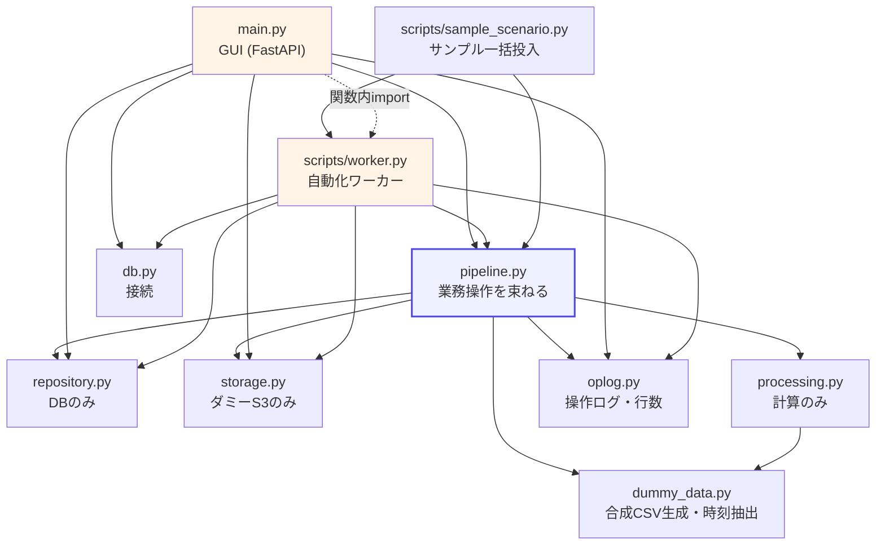
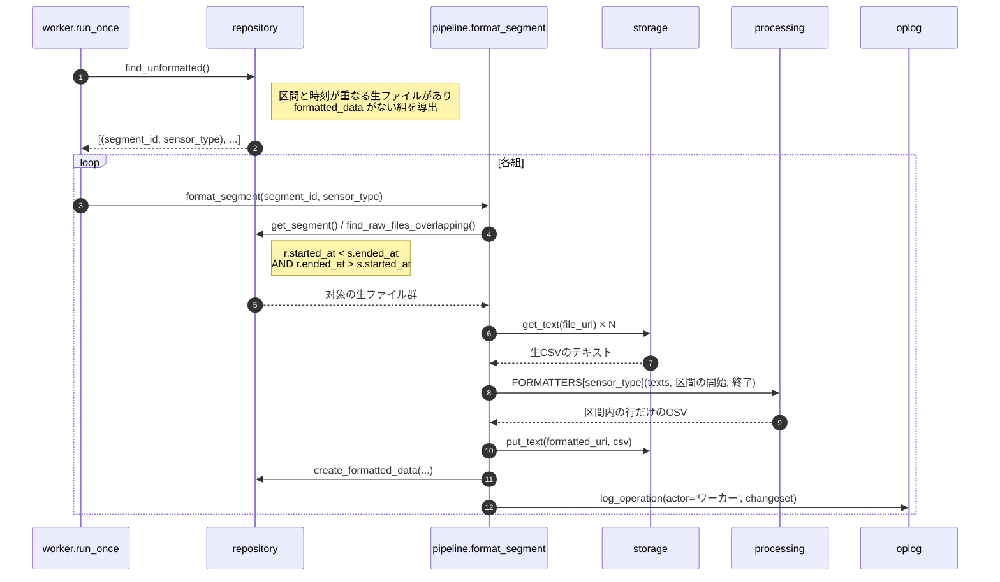

# デモ解説: 何が起きているか / どう作られているか

`README.md` が「動かし方」を扱うのに対し、本書は「**中身**」を扱う。
前半(Part 1)はデモを見せながら説明するための資料、後半(Part 2)はコードを触る人向けの構造説明。
Part 3 で本設計(`docs/`)への橋渡しを示す。

起動コマンドと本設計との差分一覧は `README.md` にあるため、ここでは繰り返さない。

---

# Part 1: デモで何が起きるか

## 1.1 全体像 — 人がやる工程と、自動で進む工程

**人の判断が本質的に必要なのは C(区間の切り出しと条件付与)まで**で、そこから先は決まった処理でしかない。
これは設計上の結論(DD-02 / DD-13)で、デモはそれが実際に成り立つことを示すために作られている。

## 1.2 各操作で何が更新されるか

デモの各画面には、この表と同じ内容が「この操作で更新されるもの」として**実行前に**表示される。
表示の元データは `demo/app/pipeline.py` の `OPERATION_EFFECTS` にあり、実装と同じファイルに置くことで
説明と実物がズレないようにしている。

| 操作 | 誰が | 更新されるテーブル | ストレージ |
|---|---|---|---|
| セッション登録 | 人 | `recording_sessions` +1 | — |
| 生データ投入 | 人 | `raw_files` +N | `.../raw/{センサー}/{seq}.csv` |
| 区間の切り出し | 人 | `segments` +1 | — |
| 整形 | ワーカー | `formatted_data` +1 | `.../segments/{id}/formatted/{センサー}.csv` |
| 推定 / 真値変換 | ワーカー | `algorithm_runs` +1, `run_inputs` +N | `.../runs/{run_id}/output.csv` |
| 評価 | ワーカー | `algorithm_runs` +1, `run_input_runs` +2, `run_metrics` +4 | 誤差時系列CSV |

すべての操作は `operation_log` にも1行ずつ残る(POC専用の可視化テーブル)。**失敗した操作も残る。**

## 1.3 データは絞られながらDBの数値に変わる

サンプルシナリオの区間1件(15分)を追った実測値。

| 段階 | 置き場所 | 量 |
|---|---|---|
| 生データ radar(10Hz × 60分) | ストレージ | 約12,000行 × 3ファイル |
| 生データ psg(1Hz × 60分) | ストレージ | 1,200行 × 3ファイル |
| 整形(区間15分で切り出し) | ストレージ | radar 9,000行 / psg 900行 |
| 推定・真値(1分窓に集約) | ストレージ | 各 15行 |
| 評価の誤差時系列 | ストレージ | 15行 |
| **評価指標** | **DB** | **4件**(`mae` `rmse` `max_abs_error` `n_windows`) |

3万行を超える生データが、最終的にDBには**4つのスカラー値**として載る。
「集計に使う数値はDB、眺める成果物はストレージ」という置き場所の規律(DD-18)が、この形で現れている。
姿勢別の平均MAEのような横断集計は、この4つがDBにあるからSQLで書ける。

## 1.4 デモの見どころ

**(a) 人と自動の境目**
`/operations`(操作履歴)を開くと、人の操作とワーカーの操作が同じ時系列に並ぶ。
どこまでが人でどこからが自動かが一目で分かる。

**(b) 残作業は状態カラムではなく問い合わせから出る**
ダッシュボードの「未整形 / 未処理 / 未評価」は、`status` のような列を持たず、
`LEFT JOIN ... IS NULL` で毎回導出している(DD-03 存在=状態)。
ワーカーはこの一覧をそのまま処理対象にする。状態列と実体がズレる余地がない。

**(c) 何度実行しても壊れない**
「ワーカーを1回実行」を押すと1段だけ進む(整形 → 実行 → 評価)。
全部終わったあとにもう一度押すと「残作業はありません」となる。
差分検出ループは途中で失敗しても次のパスが拾うため、冪等性が自然に得られる。

---

# Part 2: どう作られているか

## 2.1 レイヤ構造

(図は実行時のモジュールのみ。初期投入の `scripts/seed_db.py` と、その入力である `seed_data.py` は省いている)

読み取るべき点は2つ。

**`repository.py` は他のdemoモジュールを一切importしていない。** DBのことしか知らないため、
ストレージや計算の都合で汚れない。同様に `storage.py` はファイル、`processing.py` は計算しか見ない。

**GUI とワーカーが同じ `pipeline` に降りてくる。** 自動化とは「`pipeline` の関数を呼ぶ主体が
人からプログラムに変わるだけ」であり、追加開発が最小になる(DD-13)。
`main.py` はワーカー実行ボタンのために `worker.run_once` を**関数内で** import している(循環参照の回避)。

## 2.2 ファイル別の役割

### アプリ本体(`demo/app/`)

| ファイル | 責務 | 主要なもの | 誰が呼ぶか |
|---|---|---|---|
| `schema.sql` | 本設計13テーブル + `operation_log` のDDL | — | `db.init_db` |
| `db.py` | SQLite接続、スキーマ適用 | `get_connection` `init_db` `DB_PATH` | 全入口 |
| `repository.py` | **DBアクセスのみ**。CRUD・条件検証・差分検出 | `validate_conditions` `create_segment` `find_raw_files_overlapping` `latest_formatted_for` `find_unformatted` `find_unprocessed` `find_unevaluated` `pending_summary` | `pipeline` `main` `worker` |
| `storage.py` | **ダミーS3**。URIは `s3://` 形式を保つ | `put_text` `get_text` `raw_uri` `formatted_uri` `run_output_uri` | `pipeline` `main` |
| `dummy_data.py` | 合成センサーCSVの生成と、CSVからの時刻抽出 | `generate_files` `extract_time_range` `parse_rows` `SENSOR_SPECS` | `pipeline` `processing` |
| `processing.py` | **計算のみ**。整形とアルゴリズムのレジストリ | `FORMATTERS` `ALGORITHMS` `format_by_time_range` `estimate_hr_from_radar` `evaluate_hr` | `pipeline` |
| `oplog.py` | 操作ログと行数スナップショット | `ChangeSet` `log_operation` `table_counts` `diff_counts` `counts_by_group` `TABLES` | `pipeline` `main` |
| `pipeline.py` | 上記を束ねた**業務操作** + 事前予告の宣言 | `create_session` `generate_raw_files` `create_segment` `format_segment` `run_algorithm` `run_evaluation` `OPERATION_EFFECTS` `PipelineError` | `main` `worker` `sample_scenario` |
| `seed_data.py` | マスタの初期値とサンプルシナリオの定義 | `CONDITION_KEYS` `SENSOR_TYPES` `ALGORITHMS` `SAMPLE_SESSION` | `seed_db` `sample_scenario` |
| `main.py` | FastAPIルート(**薄いラッパ**) | `_run_operation` + 各ルート | uvicorn |

### スクリプト(`demo/scripts/`)

| ファイル | 責務 | 主要なもの |
|---|---|---|
| `seed_db.py` | DB初期化とマスタ投入。`--reset` `--with-sample` | `seed_masters` |
| `worker.py` | 差分検出ループ(ダミーEC2)。`--once` `--until-idle` `--interval` | `run_once` `run_until_idle` |
| `sample_scenario.py` | 人の工程を流し、残りをワーカーに任せる台本 | `run_sample_scenario` |

### テンプレート(`demo/app/templates/`)

役割ごとに3種類ある。

- **ページ** — `dashboard` `sessions_list` `session_new` `session_detail` `segments_list`
  `segment_register` `segment_detail` `segment_search` `run_detail` `operations`(すべて `base.html` を継承)
- **可視化のパーシャル** — `_effects.html` / `_effects_body.html`(事前予告)、
  `_op_result.html`(事後の差分)、`_worker_result.html`、`_dashboard_panel.html`
- **共通部品** — `_segments_table.html`(区間一覧。閲覧・検索・セッション詳細で共用)、`_preview.html`

htmx を使うのは、操作結果の差し込み(`hx-post` → `_op_result.html`)、
検索結果のライブ絞り込み、ワーカー実行後のダッシュボード自動更新の3か所。

## 2.3 1操作をコードで追う — 整形の場合

ワーカーが整形を1件処理するときの流れ。

ここで押さえておく点。

**入力の生ファイルは人が指定しない。** 区間の時刻と生ファイルの時刻が重なるかで機械的に逆引きする
(DD-05 / DD-17)。本設計では `tstzrange(...) && tstzrange(...)` にあたる部分だが、SQLiteに範囲型がないため
**ISO8601の書式を揃えたうえでの文字列比較**で代替している(`repository.find_raw_files_overlapping`)。
書式が揃っている限り辞書順比較が時系列順と一致する、という前提に乗っている。

**推定・真値・評価も同じ形。** `run_algorithm` は `latest_formatted_for` で入力を引き、
`ALGORITHMS[name]["func"]` を呼ぶ。`run_evaluation` だけは入力が整形データではなく
**他のrunの出力**なので、`run_inputs` ではなく `run_input_runs` に依存を記録する(DD-18 の処理のDAG)。

**出力URIの順序に注意。** `output_uri` には `run_id` が入るため、先に `algorithm_runs` を
`output_uri=NULL` で作り、確定した `run_id` でURIを組み立ててから `set_run_output_uri` で更新している。

## 2.4 「DBの何が更新されるか」を見せるしくみ

4つの部品が噛み合っている。

| 部品 | 場所 | 役割 |
|---|---|---|
| `OPERATION_EFFECTS` | `pipeline.py` | **事前予告**。操作が触るテーブルと項目の宣言。実装と同じファイルに置きズレを防ぐ |
| `ChangeSet` | `oplog.py` | 各 pipeline 関数が「書いた行」を積んでいく入れ物。主キー・代表的な値・置いたファイルURI |
| `table_counts` / `diff_counts` | `oplog.py` | **事後差分**。実行前後の全テーブル行数を取り、増減のあったものだけ返す |
| `_run_operation` | `main.py` | 上記3つを束ねる共通ラッパ。全書き込みルートがここを通る |

`_run_operation` の流れ:

1. 実行前の `table_counts` を取る
2. 操作を実行する(`PipelineError` / `StorageError` / `ValueError` を捕捉)
3. 実行後の `table_counts` を取り、`diff_counts` で差分を出す
4. `_op_result.html` に「差分」「実際に書かれた行」「置かれたファイル」を渡して描画

**失敗した場合も** `operation_log` に `status='error'` で記録する。
「失敗を必ず見せる」ことは、自動化が信頼されるための条件で、黙って失敗する仕組みは一度で信用を失う。

なお `pipeline` の各関数は成功時に自分で `log_operation` を呼ぶ。失敗時のログは `_run_operation` 側が書く。
ワーカー経由の操作は `actor='ワーカー'`、GUI経由は `actor='人'` になる。

## 2.5 拡張するには

DD-14 のレジストリ構造により、実装を足しても骨格(`pipeline` / `worker` / 画面)には触らずに済む。

**センサー種別を1つ足す**

1. `seed_data.py` の `SENSOR_TYPES` に1行(`role` は `target` か `reference`)
2. `dummy_data.py` の `SENSOR_SPECS` に生成パラメータ(サンプリング周波数と列名)
3. `processing.py` の `FORMATTERS` に整形実装(既存の `format_by_time_range` を再利用してよい)

**アルゴリズムを1つ足す**

1. `seed_data.py` の `ALGORITHMS` に1行(`role` と `input_sensor_type`)
2. `processing.py` の `ALGORITHMS` に実装を登録

どちらも `seed_db.py --reset` で反映される。ワーカーは `find_unprocessed` がマスタを見て組を作るため、
登録するだけで自動実行の対象になる。

---

# Part 3: 本設計への橋渡し

POCは意図的に簡略化してある。本番(`docs/`)に進むとき、どこを差し替えるかの対応表。
フェーズ番号は `docs/automation-plan.md` に対応する。

| POCの実装 | 本番 | 触るファイル | フェーズ |
|---|---|---|---|
| SQLite(`db.py` / `schema.sql`) | PostgreSQL(RDS)。`docs/experiment_db_ddl_v2.sql` をそのまま適用 | `db.py`、SQLは方言差の見直し | 0 |
| ローカルFS(`storage.py`) | S3(boto3)。URI文字列は変わらない | **`storage.py` のみ** | 0〜1 |
| Python側の検証(`validate_conditions` / `pipeline`) | DBトリガーも併設(DD-09の二重化) | DDL側にトリガー追加。Python側は残す | 1〜2 |
| 全件ロードしてPythonでフィルタ(`search_segments`) | `conditions @> '{...}'` + GINインデックス | `repository.py` の検索系 | 2 |
| 文字列比較の時刻重なり判定 | `tstzrange(...) && tstzrange(...)` | `repository.find_raw_files_overlapping` | 1 |
| 手動起動のワーカー(`--once`) | systemd timer で定期実行 | `worker.py` は変えず起動方法だけ | 3〜5 |
| ダミー生成(`dummy_data.py`) | 実センサーからのアップロード | `pipeline.upload_raw_file` は既に実装済み | 1 |
| `operation_log`(POC専用) | 本設計には存在しない。必要性を再検討 | — | — |

`storage.py` だけ差し替えればストレージがS3になる、という構造は意図的なもの。
逆に、**DBトリガーの不在**はPOC限定の割り切りであり、本番では必ず埋める必要がある(DD-09)。
アプリを迂回した書き込みに対する最終防衛線が、POCには存在しない。
