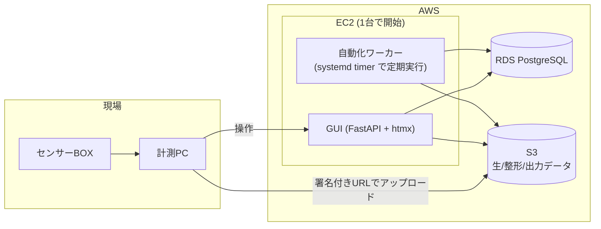

# 自動化の段階的導入計画

`design-decisions.md` の DD-13(ライブラリ・ファースト/差分検出ループ)と DD-14(Walking Skeleton)を、
実際の運用・インフラに落とすための計画。「誰が何をやめるか」を段階の単位とし、実験者の負担変化を
基準にフェーズを切る。

**本書の前提**(変わる場合は計画も見直しが必要):

- 規模は小さい。実験は週に数回、関係者は数名。同時実行される処理は多くとも数本。
- 実行基盤は AWS(EC2)を使う。
- ストレージは未決(`design-decisions.md` 未決事項)。本書は **S3 を推奨**し、BOX 継続時の差分を §4 に注記する。

---

## 1. 人がやること / 機械がやること

DD-02 と DD-13 は既に「人の判断が本質的に必要な箇所は区間の作成(条件付与)に集約された」と述べている。
本節はそれを作業レベルまで分解したもの。

### 人にしかできない(自動化の対象外)

| 作業 | なぜ人が必要か |
|---|---|
| 実験の実施(センサー設置、被験者への指示) | 物理作業 |
| **区間の切り出しと実験条件の付与** | 「この時間帯が仰臥位だった」は現場を見ていないと分からない。DD-02 の集約点 |
| マスタの追加判断・週次レビュー(表記揺れの統合、無効化) | 語彙の意味に関する判断。DD-10 |
| 新規アルゴリズムの実装、パラメータの選定 | 研究行為そのもの |
| 結果の解釈 | 同上 |

### 機械に任せられる(決定的な処理)

| 作業 | 根拠 |
|---|---|
| CSV先頭・末尾からの時刻抽出 | DD-05 が「手入力は誤りが必発のため自動抽出を必須」と明記 |
| URI規約に沿ったファイル配置とアップロード | 規約が決まれば決定的。DD-04 |
| `raw_files` への登録、`session_no`/`seq_no`/`run_no` の採番 | 決定的 |
| 区間 → 該当生ファイルの逆引き | 時刻重なり(`&&`)による導出。DD-05, DD-17 |
| 整形処理(切り出し・統合) | 入力が確定すれば決定的 |
| アルゴリズム実行、真値変換、評価 | 同上。DD-16, DD-18 |
| `run_metrics` への指標登録 | DD-18 |
| 「未整形の区間」「未処理の整形データ」の検出 | 存在=状態(DD-03)から `LEFT JOIN ... IS NULL` で導出 |

### 人が決めるが、機械がミスを防ぐ(ここが設計の勝負どころ)

| 作業 | 機械側の役割 |
|---|---|
| 実験条件の選択 | マスタからのプルダウン生成 + DBトリガー検証(DD-08, DD-09)。自由記述させない |
| 区間の時刻指定 | 生データ波形を並べて表示し、範囲外はトリガーで拒否(`trg_segment_within_session`) |
| 担当者・日付の記入 | ログイン情報と現在時刻から自動補完 |
| 入力するアルゴリズムの組 | 同一区間内に閉じているかをトリガーで検証(`trg_run_input_same_segment`) |

---

## 2. ボトルネックと人為ミスの発生箇所

自動化の順序を決める根拠。以下 B1〜B7 を本書の他の節から参照する。

### B1. 実験条件の選択ミス【最重要】

**現象**: 表記揺れ(`supine` / `仰向け`)、記入漏れ、実際と違う条件の選択。

**現状の防御**: `condition_keys` / `condition_values` マスタ + プルダウン + `trg_segments_conditions`
トリガー(DD-08, DD-09)。表記揺れと未登録値は**構造的に発生しない**。

**残存リスク**: 「選択肢としては正しいが、実際の実験と違う条件を選んだ」ケースは DB では検出できない。
これがボトルネックの本体。

**対策**: 条件を選ぶ画面に、その区間の生データ波形を並べて表示する。値そのものを検証するのではなく、
「実験の記憶が新しいうちに、データを見ながら付ける」状況を作る。加えて DD-11 の留意点にある監査クエリ
(同時刻に矛盾する条件が付いていないか)を週次で回す。

### B2. デバイス間の時計ズレ【自動化の前提条件】

**現象**: 真値デバイスと評価対象センサーの時計がズレると、時刻重なりによる切り出しが全件ズレる。

**なぜ重大か**: 自動化の土台(B1以外のほぼ全ての自動処理)が時刻の信頼性に乗っている。ここが崩れると
自動化が「静かに間違った結果を大量生産する」状態になる。手作業なら気づけたズレが、自動化すると気づけない。

**対策**: **フェーズ1に着手する前**に計測手順として時刻合わせを確立する(DD-17 の留意点)。
手順で足りなくなった時点で `raw_files` にオフセット列を追加する判断に進む。

### B3. ファイルの取り違え・アップロード漏れ

**現象**: 別セッションのファイルを混ぜる、一部センサーのファイルを上げ忘れる。

**対策**: 人がストレージを直接触らない(ツール経由のみ)。アップロード後に
「このセッションに登録されたセンサー種別と時刻範囲」のサマリを提示し、欠けに気づける状態にする
(`sequence_diagrams.md` シナリオ1の最終ステップ)。

### B4. 手作業によるURI規約からの逸脱

**現象**: 手でフォルダを作る・リネームすることで、DB の URI と実体がズレる。

**対策**: B3 と同じ。ストレージへの書き込み権限をアプリの実行ロールに限定する。

### B5. 区間の時刻タイポ / 二重登録

**対策**: 既に防御済み。`trg_segment_within_session` と、DD-12 の業務キー UNIQUE 制約。

### B6. アルゴリズムのバージョンが追えない【スキーマ上のギャップ】

**現象**: 自動実行で試行数が増えると「この結果はどのコードで出たか」が追えなくなる。

**現状**: `algorithm_runs` は `algorithm_name` と `algo_conditions` を持つが、**コードのバージョンを
記録する場所がない**。手動実行で件数が少ないうちは記憶で補えるが、自動化すると破綻する。

**対策(要判断)**: `algo_conditions` に `code_version`(git commit hash 等)を入れる規約にするか、
`algorithm_runs` に専用カラムを立てるか。**フェーズ4に着手する前に決める必要がある**。§7 に再掲。

### B7. `algo_conditions` にマスタ検証がかかっていない

**現状**: `segments.conditions` と `recording_sessions.setup` にはマスタ検証トリガーがあるが、
`algorithm_runs.algo_conditions` にはない(`experiment_db_ddl_v2.sql` 参照)。

**影響**: アルゴリズムのパラメータ名が揺れると、DD-18 が狙う横断集計(パラメータ別の平均MAE等)が壊れる。
ただし条件と違って入力するのは開発者自身なので、B1 ほど緊急ではない。フェーズ4で必要性を再評価する。

---

## 3. 自動化の中核: 差分検出ループ

DD-13 の通り、メッセージキューやファイル監視は使わない。存在=状態(DD-03)から、次のクエリを定期実行して
「やるべきことの一覧」を毎回ゼロから導出する。途中で失敗しても次のループが拾うため、冪等性が自然に得られる。

**未整形の区間 × センサー**(フェーズ3で使う):

```sql
SELECT DISTINCT s.segment_id, r.sensor_type
FROM segments s
JOIN raw_files r
  ON r.session_id = s.session_id
 AND tstzrange(r.started_at, r.ended_at) && tstzrange(s.started_at, s.ended_at)
LEFT JOIN formatted_data f
  ON f.segment_id = s.segment_id AND f.sensor_type = r.sensor_type
WHERE f.formatted_id IS NULL;
```

そのセッションに実際に生データが存在するセンサーだけが対象になる点が重要(全センサーとの直積にしない)。

**推定runと真値runが揃っていて、評価runがない組**(フェーズ5で使う):

```sql
SELECT est.segment_id, est.run_id AS est_run_id, gt.run_id AS gt_run_id
FROM algorithm_runs est
JOIN algorithms a_est
  ON a_est.algorithm_name = est.algorithm_name AND a_est.role = 'estimation'
JOIN algorithm_runs gt
  ON gt.segment_id = est.segment_id
JOIN algorithms a_gt
  ON a_gt.algorithm_name = gt.algorithm_name AND a_gt.role = 'ground_truth'
WHERE NOT EXISTS (
    SELECT 1 FROM algorithm_runs ev
    JOIN algorithms a_ev
      ON a_ev.algorithm_name = ev.algorithm_name AND a_ev.role = 'evaluation'
    JOIN run_input_runs ri1 ON ri1.run_id = ev.run_id AND ri1.input_run_id = est.run_id
    JOIN run_input_runs ri2 ON ri2.run_id = ev.run_id AND ri2.input_run_id = gt.run_id
);
```

後者は、同一区間に推定runや真値runが複数ある場合(再実行・パラメータ違い)、その組み合わせの数だけ行が返る。
「どの組を評価するか」(最新同士だけか、全組み合わせか)は運用の判断であり、フェーズ5で決める。

なお上記2本は本書執筆時点で実行検証をしていない(PostgreSQL環境が未構築のため)。フェーズ0の
Walking Skeleton で最初に実行して確かめる対象になる。

ポーリング間隔は未決事項だが、この規模なら 5〜15分で十分。LISTEN/NOTIFY への移行は運用負荷の実測後。

---

## 4. インフラ構成



**各要素の選定理由**:

- **DB は RDS**。EC2 内に Postgres を立てるとバックアップ・復旧を自分で持つことになる。`db.t3.micro` 程度で開始。
- **ストレージは S3 を推奨**。EC2 からの IAM ロール認証、署名付きURLでのブラウザ直接アップロード、
  ライフサイクル管理が揃っており、自動化ワーカーの実装が最も単純になる。
  **BOX を継続する場合**、アップロード/ダウンロードが BOX API 経由になり、認証トークンの更新管理と
  レート制限への対処がワーカー側に必要になる。動かないわけではないが、フェーズ3以降の実装コストが上がる。
  この選定は §7 の通り**フェーズ1着手前に決める**。
- **実行基盤は EC2 1台**から。GUI とワーカーを同居させる。`t3.medium` 程度で開始し、整形処理が重ければ
  ワーカーだけ別インスタンスに分離する。ECS/Batch は現時点では過剰。
- **GUI は demo/ の延長**(FastAPI + htmx)。既にローカルで動く実装があるため、そのまま育てられる。
- **アクセス制限**: 社内からのみ。セキュリティグループか VPN で制限する。
- **監視**: ワーカーの生死と失敗件数を CloudWatch に出す。§6 の「失敗の可視化」と対になる。

---

## 5. 段階的な導入計画

各フェーズは「**実験者がやめる作業を1つだけ**」を原則に切ってある。
フェーズ1と2は自動化ではなく**入力の構造化**であり、実験者にとっては一時的に作業が増えたように感じる。
この谷を越えるために、フェーズ3(最初の「勝手に動く」体験)には早めに到達したい。

### フェーズ0: 土台(自動化の前にやること)

- 現行Excelの実験条件欄を棚卸しし、`condition_keys` / `condition_values` の初期セットを登録する(未決事項)
- **B2(時計同期)の計測手順を確立する**。ここが未整備のままフェーズ3以降に進むと、誤った結果を自動生産する
- ストレージ(S3 / BOX)を決定し、URI規約を確定する
- DD-14 の Walking Skeleton をダミー処理で通し、スキーマ・URI規約・検索の統合点を洗い出す

**完了条件**: ダミーデータで「セッション登録→生ファイル→区間→整形→処理→検索」が一本通る。

### フェーズ1: 記録のデジタル化

**実験者の変化**: Excel に書く代わりに画面に入力する。ファイルは画面からアップロードする。

**自動化される範囲**: 時刻抽出(B2/DD-05)、URI採番、`raw_files` 登録、`session_no` 採番。

**残る手作業**: 区間切り出し、整形、アルゴリズム実行のすべて。

**価値**: 表記揺れが消え、ファイルの所在が一意に決まる(B3, B4 が構造的に解消)。

**完了条件**: 1ヶ月分の実験がこの経路だけで登録され、Excel を併用しなくてよくなる。

### フェーズ2: 条件付与のGUI化【B1 対策の本体】

**実験者の変化**: 実験条件を自由記述でなくプルダウンから選ぶ。区間を画面上で指定する。

**自動化される範囲**: 条件の検証(マスタ照合・範囲チェック)、区間→生ファイルの逆引き表示。

**残る手作業**: 整形、アルゴリズム実行。

**ここに一番手をかける**。B1 が最大のボトルネックであり、後段の自動化がすべてこの入力の正しさに乗るため。
生データ波形を並べて表示しながら区間を選べる UI を目指す。マスタ追加フロー(`sequence_diagrams.md`
シナリオ4)もここで通す。

**完了条件**: 新しい実験条件が発生したときに、利用者が自分でマスタに追加して即座に使える。

### フェーズ3: 整形の自動化【最初の「勝手に動く」体験】

**実験者の変化**: 区間を作って条件を付けたら、しばらくすると整形済みデータができている。

**自動化される範囲**: §3 の差分検出クエリ + 整形関数の呼び出し。

**進め方**: **1センサー種別から始める**。DD-14 のレジストリ構造により、対象を増やしても骨格は変わらない。

**必須要件**: 失敗した区間が画面で見えること。黙って失敗すると実験者の信頼を一度で失う(§6)。

**完了条件**: 対象センサーについて、人が整形コマンドを叩く必要がなくなる。

### フェーズ4: アルゴリズム実行の自動化

**実験者の変化**: 整形済みデータに対する定型的な処理が自動で走る。

**前提**: **B6(アルゴリズムのバージョン記録)をここまでに決めておく**。試行数が増えてから遡って
付けることはできない。

**進め方**: アルゴリズムを1つずつ登録して増やす。パラメータ探索のような非定型な実行は手動のまま残す。

### フェーズ5: 真値変換と評価の自動化

**実験者の変化**: 実験して条件を付ければ、翌朝には評価指標(`run_metrics`)が出ている。

**自動化される範囲**: 真値変換run、評価runの起動、`run_input_runs` による依存記録、指標登録(DD-16, DD-18)。

DD-18 の通り、これは差分検出ループに段を1つ足すだけで済む。

**完了条件**: 姿勢別・アルゴリズム別の平均MAE等が、人が集計作業をせずに SQL で引ける。

### フェーズ6: アップロードの自動化

**実験者の変化**: 計測PCにファイルが置かれると自動で吸い上げられる。アップロード操作がなくなる。

**なぜ最後か**: 人の操作を最も減らすが、常駐エージェントはネットワーク断・部分書き込み・PC再起動など
壊れ方が多い。他が安定してから着手する。ここまでの各フェーズは、この機能がなくても完結している。

---

## 6. 全フェーズ共通の原則

- **手動フォールバックを常に残す**。DD-13 のライブラリ・ファーストにより、自動化とは「関数を呼ぶ主体が
  人からプログラムに変わる」だけである。自動が壊れたらその日は手動で回せる状態を維持する。
- **失敗を必ず見せる**。「未整形の区間がN件」「失敗した処理がN件」を GUI のトップに出す。DD-03 の
  存在=状態から、この一覧は追加のテーブルなしで導出できる。
- **1フェーズで人がやめる作業は1つ**。同時に複数を変えると、問題が起きたときに原因を切り分けられない。
- **各フェーズで止まっても価値が残る形にする**(DD-14)。予算や人員の都合でフェーズ4以降に進めなくても、
  フェーズ2までで B1・B3・B4 は解消されている。

---

## 7. この計画から生じた要決定事項

| 項目 | 期限 | 備考 |
|---|---|---|
| ストレージ選定(S3 / BOX) | フェーズ1着手前 | 既存の未決事項。§4 の通り S3 推奨 |
| `condition_keys` の初期セット | フェーズ0 | 既存の未決事項。現行Excelの棚卸しが必要 |
| 時計同期の担保方法 | フェーズ0(フェーズ3の前提) | B2。既存の未決事項(DD-17) |
| アルゴリズムのバージョン記録方法 | フェーズ4着手前 | **B6。新規に判明したスキーマ上のギャップ** |
| `algo_conditions` のマスタ検証 | フェーズ4で再評価 | B7 |
| 自動化ループのポーリング間隔 | フェーズ3 | 既存の未決事項。初期値は5〜15分を想定 |

決定した項目は `design-decisions.md` に DD として追記し、本書からは参照する形にする。
