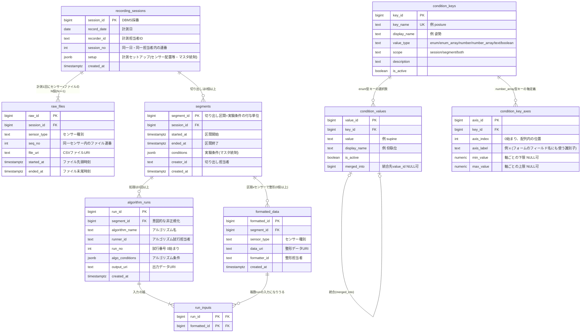

# ER図

```mermaid
erDiagram
    recording_sessions {
        bigint session_id PK "DBMS採番"
        date record_date "計測日"
        text recorder_id "計測担当者ID"
        int session_no "同一日・同一担当者内の連番"
        jsonb setup "計測セットアップ(センサー配置等・マスタ統制)"
        timestamptz created_at
    }

    raw_files {
        bigint raw_id PK
        bigint session_id FK
        text sensor_type "センサー種別"
        int seq_no "同一センサー内のファイル連番"
        text file_uri "CSVファイルURI"
        timestamptz started_at "ファイル先頭時刻"
        timestamptz ended_at "ファイル末尾時刻"
    }

    segments {
        bigint segment_id PK "切り出し区間=実験条件の付与単位"
        bigint session_id FK
        timestamptz started_at "区間開始"
        timestamptz ended_at "区間終了"
        jsonb conditions "実験条件(マスタ統制)"
        text creator_id "切り出し担当者"
        timestamptz created_at
    }

    formatted_data {
        bigint formatted_id PK
        bigint segment_id FK
        text sensor_type "センサー種別"
        text data_uri "整形データURI"
        text formatter_id "整形担当者"
        timestamptz created_at
    }

    algorithm_runs {
        bigint run_id PK
        bigint segment_id FK "意図的な非正規化"
        text algorithm_name "アルゴリズム名"
        text runner_id "アルゴリズム試行担当者"
        int run_no "試行番号 0始まり"
        jsonb algo_conditions "アルゴリズム条件"
        text output_uri "出力データURI"
        timestamptz created_at
    }

    run_inputs {
        bigint run_id PK "FK"
        bigint formatted_id PK "FK"
    }

    condition_keys {
        bigint key_id PK
        text key_name UK "例 posture"
        text display_name "例 姿勢"
        text value_type "enum/enum_array/number/number_array/text/boolean"
        text scope "session/segment/both"
        text description
        boolean is_active
    }

    condition_values {
        bigint value_id PK
        bigint key_id FK
        text value "例 supine"
        text display_name "例 仰臥位"
        boolean is_active
        bigint merged_into "統合先value_id NULL可"
    }

    condition_key_axes {
        bigint axis_id PK
        bigint key_id FK
        int axis_index "0始まり、配列内の位置"
        text axis_label "例 x (フォームのフィールド名にも使う識別子)"
        numeric min_value "軸ごとの下限 NULL可"
        numeric max_value "軸ごとの上限 NULL可"
    }

    recording_sessions ||--|{ raw_files : "計測1回にセンサーxファイルのN個(N>=1)"
    recording_sessions ||--o{ segments : "切り出しは0個以上"
    segments ||--o{ formatted_data : "区間xセンサーで整形(0個以上)"
    segments ||--o{ algorithm_runs : "処理は0回以上"
    algorithm_runs ||--|{ run_inputs : "入力の組"
    formatted_data ||--o{ run_inputs : "複数runの入力になりうる"
    condition_keys ||--o{ condition_values : "enum型キーの選択肢"
    condition_keys ||--o{ condition_key_axes : "number_array型キーの軸定義"
    condition_values |o--o| condition_values : "統合(merged_into)"
```
