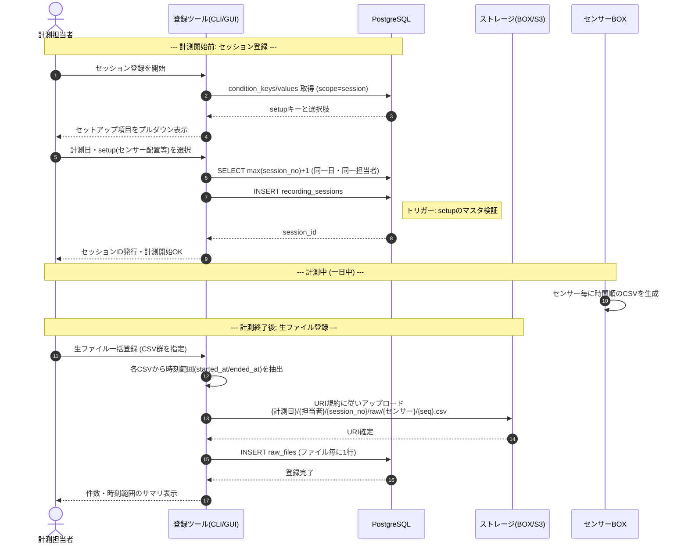
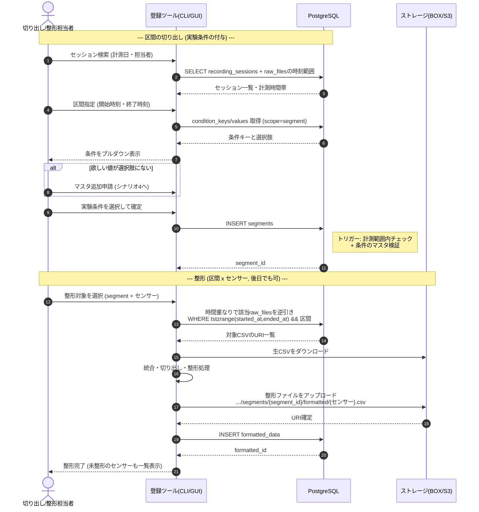
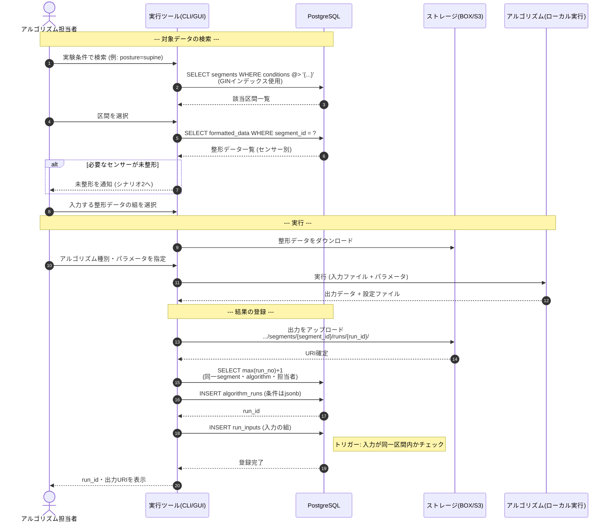
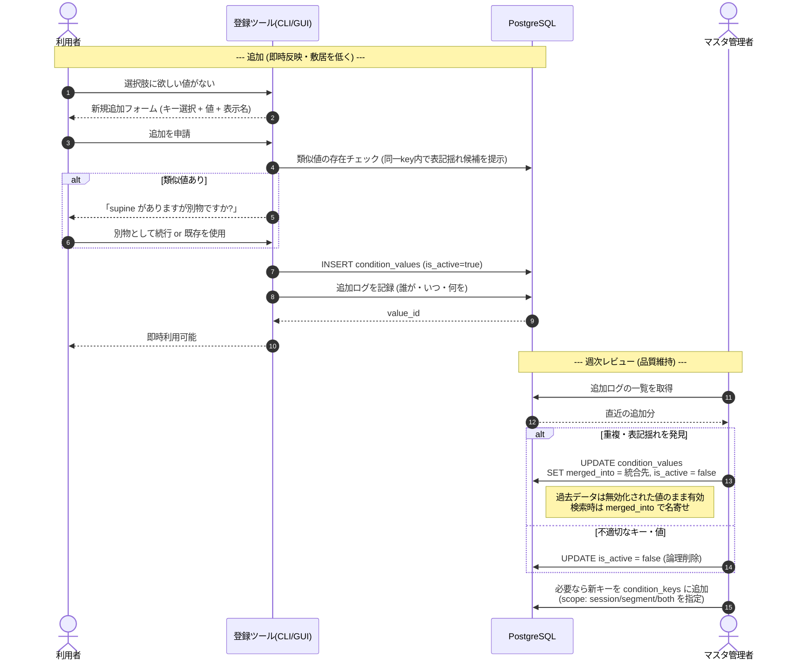

# シーケンス図

## 1. recording

```mermaid
sequenceDiagram
    autonumber
    actor R as 計測担当者
    participant T as 登録ツール(CLI/GUI)
    participant DB as PostgreSQL
    participant ST as ストレージ(BOX/S3)
    participant SB as センサーBOX

    Note over R,DB: --- 計測開始前: セッション登録 ---
    R->>T: セッション登録を開始
    T->>DB: condition_keys/values 取得 (scope=session)
    DB-->>T: setupキーと選択肢
    T-->>R: セットアップ項目をプルダウン表示
    R->>T: 計測日・setup(センサー配置等)を選択
    T->>DB: SELECT max(session_no)+1 (同一日・同一担当者)
    T->>DB: INSERT recording_sessions
    Note right of DB: トリガー: setupのマスタ検証
    DB-->>T: session_id
    T-->>R: セッションID発行・計測開始OK

    Note over R,SB: --- 計測中 (一日中) ---
    SB->>SB: センサー毎に時間順のCSVを生成

    Note over R,ST: --- 計測終了後: 生ファイル登録 ---
    R->>T: 生ファイル一括登録 (CSV群を指定)
    T->>T: 各CSVから時刻範囲(started_at/ended_at)を抽出
    T->>ST: URI規約に従いアップロード<br/>{計測日}/{担当者}/{session_no}/raw/{センサー}/{seq}.csv
    ST-->>T: URI確定
    T->>DB: INSERT raw_files (ファイル毎に1行)
    DB-->>T: 登録完了
    T-->>R: 件数・時刻範囲のサマリ表示

```

## 2. segment format

```mermaid
sequenceDiagram
    autonumber
    actor A as 切り出し/整形担当者
    participant T as 登録ツール(CLI/GUI)
    participant DB as PostgreSQL
    participant ST as ストレージ(BOX/S3)

    Note over A,DB: --- 区間の切り出し (実験条件の付与) ---
    A->>T: セッション検索 (計測日・担当者)
    T->>DB: SELECT recording_sessions + raw_filesの時刻範囲
    DB-->>T: セッション一覧・計測時間帯
    A->>T: 区間指定 (開始時刻・終了時刻)
    T->>DB: condition_keys/values 取得 (scope=segment)
    DB-->>T: 条件キーと選択肢
    T-->>A: 条件をプルダウン表示
    alt 欲しい値が選択肢にない
        A->>T: マスタ追加申請 (シナリオ4へ)
    end
    A->>T: 実験条件を選択して確定
    T->>DB: INSERT segments
    Note right of DB: トリガー: 計測範囲内チェック<br/>+ 条件のマスタ検証
    DB-->>T: segment_id

    Note over A,ST: --- 整形 (区間 x センサー, 後日でも可) ---
    A->>T: 整形対象を選択 (segment + センサー)
    T->>DB: 時間重なりで該当raw_filesを逆引き<br/>WHERE tstzrange(started_at,ended_at) && 区間
    DB-->>T: 対象CSVのURI一覧
    T->>ST: 生CSVをダウンロード
    T->>T: 統合・切り出し・整形処理
    T->>ST: 整形ファイルをアップロード<br/>.../segments/{segment_id}/formatted/{センサー}.csv
    ST-->>T: URI確定
    T->>DB: INSERT formatted_data
    DB-->>T: formatted_id
    T-->>A: 整形完了 (未整形のセンサーも一覧表示)
```

## 3. run algorithm

```mermaid
sequenceDiagram
    autonumber
    actor U as アルゴリズム担当者
    participant T as 実行ツール(CLI/GUI)
    participant DB as PostgreSQL
    participant ST as ストレージ(BOX/S3)
    participant AL as アルゴリズム(ローカル実行)

    Note over U,DB: --- 対象データの検索 ---
    U->>T: 実験条件で検索 (例: posture=supine)
    T->>DB: SELECT segments WHERE conditions @> '{...}'<br/>(GINインデックス使用)
    DB-->>T: 該当区間一覧
    U->>T: 区間を選択
    T->>DB: SELECT formatted_data WHERE segment_id = ?
    DB-->>T: 整形データ一覧 (センサー別)
    alt 必要なセンサーが未整形
        T-->>U: 未整形を通知 (シナリオ2へ)
    end
    U->>T: 入力する整形データの組を選択

    Note over U,AL: --- 実行 ---
    T->>ST: 整形データをダウンロード
    U->>T: アルゴリズム種別・パラメータを指定
    T->>AL: 実行 (入力ファイル + パラメータ)
    AL-->>T: 出力データ + 設定ファイル

    Note over T,DB: --- 結果の登録 ---
    T->>ST: 出力をアップロード<br/>.../segments/{segment_id}/runs/{run_id}/
    ST-->>T: URI確定
    T->>DB: SELECT max(run_no)+1<br/>(同一segment・algorithm・担当者)
    T->>DB: INSERT algorithm_runs (条件はjsonb)
    DB-->>T: run_id
    T->>DB: INSERT run_inputs (入力の組)
    Note right of DB: トリガー: 入力が同一区間内かチェック
    DB-->>T: 登録完了
    T-->>U: run_id・出力URIを表示
```

## 4. master management

```mermaid
sequenceDiagram
    autonumber
    actor U as 利用者
    participant T as 登録ツール(CLI/GUI)
    participant DB as PostgreSQL
    actor M as マスタ管理者

    Note over U,DB: --- 追加 (即時反映・敷居を低く) ---
    U->>T: 選択肢に欲しい値がない
    T-->>U: 新規追加フォーム (キー選択 + 値 + 表示名)
    U->>T: 追加を申請
    T->>DB: 類似値の存在チェック (同一key内で表記揺れ候補を提示)
    alt 類似値あり
        T-->>U: 「supine がありますが別物ですか?」
        U->>T: 別物として続行 or 既存を使用
    end
    T->>DB: INSERT condition_values (is_active=true)
    T->>DB: 追加ログを記録 (誰が・いつ・何を)
    DB-->>T: value_id
    T-->>U: 即時利用可能

    Note over M,DB: --- 週次レビュー (品質維持) ---
    M->>DB: 追加ログの一覧を取得
    DB-->>M: 直近の追加分
    alt 重複・表記揺れを発見
        M->>DB: UPDATE condition_values<br/>SET merged_into = 統合先, is_active = false
        Note right of DB: 過去データは無効化された値のまま有効<br/>検索時は merged_into で名寄せ
    else 不適切なキー・値
        M->>DB: UPDATE is_active = false (論理削除)
    end
    M->>DB: 必要なら新キーを condition_keys に追加<br/>(scope: session/segment/both を指定)
```
